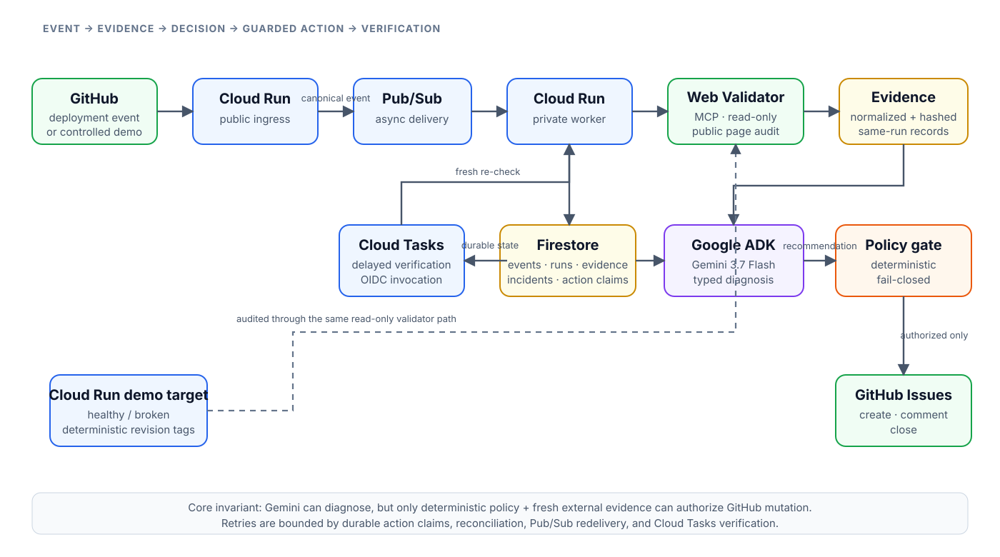

# Searcharis

**Autonomous Search Regression Guardian**

Searcharis is an event-driven agent that reacts to successful website deployments, audits the live public site, asks Gemini to classify the resulting evidence, applies a deterministic authorization policy, opens a bounded GitHub incident for material search regressions, and refuses to close that incident until a fresh external audit proves the original finding is gone.

Built for the **Taskmaster** track of the All Things Agentic Hackathon.

> **Judging availability:** keep https://searcharis-ingress-2wzjcu6mqa-uc.a.run.app live and testable through **October 1, 2026 at 11:45 PM PT**. Do not tear down the judging environment before that deadline. See [`docs/JUDGING-OPERATIONS.md`](docs/JUDGING-OPERATIONS.md).

## The problem

A deployment can silently remove a title, canonical, viewport declaration, structured data, or another search-critical signal. The failure may be technically small while its business impact is delayed and difficult to attribute. Conventional monitoring checks availability; Searcharis checks whether a successful deployment changed the site's search-facing contract and then owns the incident lifecycle until recovery is independently verified.

## What makes it agentic

Searcharis is not a cron report or an LLM wrapper. A deployment event starts a durable workflow that crosses multiple systems:

1. A GitHub deployment event reaches a public Cloud Run ingress service.
2. Ingress verifies the webhook signature and publishes an immutable event to Pub/Sub.
3. A private Cloud Run worker audits the live page through the hosted Web Validator MCP.
4. Google ADK + **Gemini 3.7 Flash** interpret a bounded evidence packet and return a typed decision.
5. Deterministic policy code decides whether that recommendation is authorized to mutate GitHub.
6. The narrow GitHub broker can only create an issue, comment on it, or close it.
7. Firestore persists events, runs, evidence, incidents, and idempotency claims.
8. Cloud Tasks schedules authenticated re-verification.
9. Closure is allowed only when a new completed audit no longer contains the triggering finding.

## Core invariant

> A model-only assertion of recovery can never close an incident.

Gemini has diagnostic authority. Typed policy code has mutation authority. Fresh external evidence has closure authority.

## Verified live proof

On August 30, 2026, the production Google Cloud deployment passed the bounded end-to-end proof on the same reviewed runtime tree:

- 5 identical Pub/Sub deployment events produced exactly 1 new incident and 1 GitHub issue.
- The demo target was restored to the healthy revision.
- Cloud Tasks triggered a fresh validator audit.
- Searcharis posted exactly 1 verification comment, closed the issue exactly once, and reached `RESOLVED`.

Evidence: [GitHub Actions run #23](https://github.com/AKzar1el/searcharis/actions/runs/33323705127) · [proof issue #8](https://github.com/AKzar1el/searcharis/issues/8)

## Architecture



Source diagram: [`docs/architecture.mmd`](docs/architecture.mmd)

Google Cloud services used in the running design:

- Cloud Run — public ingress, private worker, and deterministic demo target
- Pub/Sub — asynchronous deployment-event delivery
- Firestore — durable workflow and idempotency state
- Cloud Tasks — delayed authenticated verification
- Vertex AI — Gemini 3.7 Flash through Google ADK
- Secret Manager — GitHub token, webhook secret, demo token

## Safety and failure boundaries

- GitHub webhook HMAC is verified before JSON parsing.
- The public demo endpoint is token-protected and hard-allowlisted to one configured repository and target URL.
- The worker is private; Pub/Sub and Cloud Tasks invoke it with Google-issued identity tokens.
- The validator is read-only and receives only the configured public target.
- Gemini receives bounded structured evidence and no GitHub mutation tool.
- GitHub writes are limited to issue create, issue comment, and issue close.
- Use a fine-grained GitHub token restricted to the configured demo/submission repository with **Issues: read and write** only; Searcharis does not need Contents, Actions, Pull requests, Administration, or Secrets permissions.
- Evidence older than ten minutes, missing evidence IDs, provider failures, mixed-run evidence, and ambiguous decisions fail closed.
- Stable incident fingerprints, leased action keys with reconciliation, and Cloud Task IDs make retries idempotent.
- Pub/Sub retryable failures return HTTP 500; delivery uses bounded exponential redelivery and a dead-letter path.

## Hackathon work and pre-existing dependency disclosure

**Searcharis was created during the All Things Agentic Hackathon submission period.**

It consumes the pre-existing open-source `AKzar1el/mcp-web-validator` service as an external read-only audit dependency. That service predates the hackathon and is not claimed as hackathon-built work. All Searcharis orchestration, ADK/Gemini logic, Google Cloud event processing, persistence, policy enforcement, GitHub incident lifecycle, verification workflow, demo target, and UI in this repository were created for the hackathon.

No Search Console or TrendPulse dependency is required for the submitted workflow.

## Repository layout

```text
src/searcharis/          agent, policy, storage, integrations, services, HTTP apps
demo_target/             deterministic healthy/broken public target
deployment/              Google Cloud bootstrap, deploy, and smoke scripts
tests/unit/              pure behavior and integration-contract tests
tests/integration/       lifecycle and HTTP boundary tests
tests/live/              opt-in hosted validator smoke test
docs/                    architecture, demo script, submission material
```

## Local development

Requirements:

- Python 3.11+
- `uv`

```bash
uv sync --locked
uv run pytest tests/unit tests/integration -q
uv run ruff check src tests demo_target
```

The live validator test is deliberately opt-in:

```bash
export SEARCHARIS_LIVE_TEST_URL="https://your-public-test-page.example/"
uv run pytest tests/live/test_validator_live.py -m live -q
```

The unit/integration suite does not need Gemini, Google Cloud credentials, GitHub credentials, or network access.

## Google Cloud deployment

Authenticate `gcloud`, choose a project, and create three Secret Manager secrets with enabled versions:

```text
searcharis-github-token
searcharis-webhook-secret
searcharis-demo-token
```

Then:

```bash
export GOOGLE_CLOUD_PROJECT="your-project-id"
export GOOGLE_CLOUD_LOCATION="us-central1"
export SEARCHARIS_DEMO_REPOSITORY="owner/demo-repository"

./deployment/bootstrap.sh
./deployment/deploy-demo-target.sh

export SEARCHARIS_DEMO_TARGET_URL="$(gcloud run services describe searcharis-demo-target \
  --region="$GOOGLE_CLOUD_LOCATION" --format='value(status.url)')"

./deployment/deploy-services.sh
./deployment/smoke.sh
```

The bootstrap script enables only the APIs used by this project, creates the service identities/topic/queue/database if missing, enables operational Firestore TTL policies, and provisions the bounded incident-query index. `deploy-services.sh` binds Pub/Sub and Cloud Tasks invoker identities specifically to the private worker service, configures Pub/Sub exponential retry/dead-letter delivery, and applies explicit Cloud Run resource/backpressure limits.

## Demo target

The demo target has two tagged Cloud Run revisions:

```bash
# Introduce the regression
gcloud run services update-traffic searcharis-demo-target \
  --region="$GOOGLE_CLOUD_LOCATION" --to-tags=broken=100

# Restore the page
gcloud run services update-traffic searcharis-demo-target \
  --region="$GOOGLE_CLOUD_LOCATION" --to-tags=healthy=100
```

The broken revision removes only the `<title>` from an otherwise stable page. The current hosted validator reports that condition deterministically as `seo.missing_title`, making the recorded demo reproducible instead of depending on delayed Search Console data.

## Tests that protect the claim

The suite specifically verifies:

- stable incident and action fingerprints
- invalid workflow transitions are rejected
- stale/missing evidence cannot authorize mutation
- a model cannot close an incident while `seo.missing_title` is still present
- a completed clean audit can authorize closure
- duplicate deployment delivery does not open a second issue
- a resolved regression that recurs on a later deployment creates a fresh incident occurrence without weakening same-event duplicate idempotency
- recovery adds verification evidence before closing
- GitHub write routes are restricted to issue create/comment/close
- webhook authentication happens before payload parsing
- the public demo ingress cannot be used as an arbitrary URL scanner
- retryable worker outcomes cause Pub/Sub redelivery
- transient Gemini failures are retried with a bounded backoff and then redelivered by infrastructure
- stale GitHub mutation leases reconcile remote state before repeating a side effect
- production deployment scripts declare Pub/Sub DLQ/backoff, Firestore TTL/index, and Cloud Run limits

## Submission material

- [`docs/demo-script.md`](docs/demo-script.md) — four-minute recording plan
- [`docs/submission-draft.md`](docs/submission-draft.md) — Devpost copy draft
- [`docs/JUDGING-OPERATIONS.md`](docs/JUDGING-OPERATIONS.md) — judging availability and production operations
- [`docs/superpowers/specs/2026-08-29-searcharis-design.md`](docs/superpowers/specs/2026-08-29-searcharis-design.md) — architecture/design record
- [`docs/superpowers/specs/2026-08-30-searcharis-production-hardening-design.md`](docs/superpowers/specs/2026-08-30-searcharis-production-hardening-design.md) — production hardening design

## License

MIT